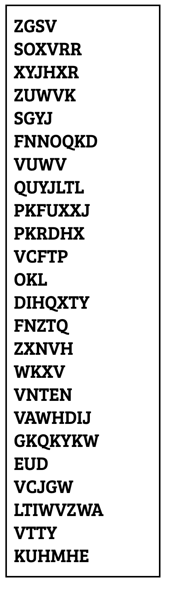
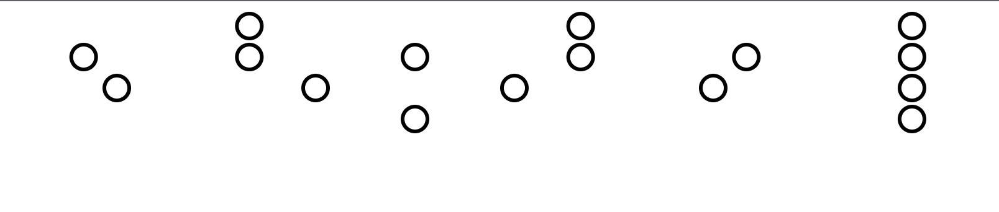
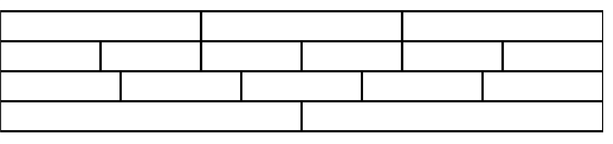

Skin Wallet
====

Store your [wallet seed phrase](https://unchained.com/blog/what-is-a-bitcoin-seed-phrase/) in plain sight, with low risk of decoding. Creates an SVG and PNG of the encrypted phrase, the decryption key, and a QR code for coin deposit.

## 🌐 Web Interface

**Try the live web interface:** [Skin Wallet Generator](https://samjhill.github.io/skin-wallet/)

The web interface allows you to:
- 🔒 **Encrypt** seed phrases with a custom decryption key
- 🔓 **Decrypt** encrypted phrases back to readable text
- 🎨 **Generate visual art** (SVG/PNG) for tattoo designs
- 📱 **Create QR codes** for easy sharing
- 💾 **Download** all outputs in various formats

**Features:**
- ✨ **Modern, responsive UI** that works on all devices
- 🔐 **Client-side processing** - your data never leaves your browser
- 🚀 **Powered by Pyodide** - runs Python code directly in the browser
- 📱 **Mobile-friendly** design with touch-optimized controls
- 🎯 **Real-time validation** and word counting
- 📊 **Multiple output formats** (SVG, PNG, QR codes, text files)

**Security:** All processing happens locally in your browser using Pyodide. No data is sent to any server.

Example cyphered seed:




Your decryption key is also generated into art that you can hide inside another tattoo, if you wish.
Example decryption key [3, 6, 5, 2]. There are a few options you can try.

Circle:



Rect:




Encodes words with a [Vigenère Cypher](https://en.wikipedia.org/wiki/Vigen%C3%A8re_cipher). It shifts each character in each word by one number in a list of numbers you provide (as opposed to every word shifted the same amount, like a [Caesar Cypher](https://en.wikipedia.org/wiki/Caesar_cipher)). In this way, all you have to do is remember the list (or safely store the decryption key above hidden in another tattoo) to be able to decode your cyphered seed phrase and access your money. 

In theory, this could allow you to get a tattoo with this cyphered phrase and be able to access your seed phrase from anywhere, carrying nothing on your person, and without a computer, while anyone looking at the words would not be able to decypher them unless they knew the array you used to set it up.

To add another layer of security, I was thinking you could use UV-reactive tattoo ink, so you'd have to know where to look (and have a blacklight) to find the cyphered phrase.


⚠️ **IMPORTANT DISCLAIMERS:**

1. **Educational Purpose Only:** This tool is for educational and artistic purposes only
2. **Not Cryptographically Secure:** The Vigenère cipher is easily breakable by modern standards
3. **Not for Real Cryptocurrency:** Do not use this for actual cryptocurrency storage
4. **Tattoo Risks:** Tattoos are permanent and can fade, blur, or become unreadable
5. **No Recovery:** If you lose the decryption key or can't read the tattoo, funds are lost forever

**For real cryptocurrency security, use:**
- Hardware wallets (Ledger, Trezor)
- Secure paper backups
- Professional security practices

This project is **for fun and theory only**.

For example:

```
"TEST", [1,2,3,4]

returns

"UGVX"

In this example, `"TEST"` is one of your seed words:

"T" is shifted by 1 character, to "U".
"E" is shifted by 2 characters, to "G".
"S" is shifted by 3 characters, to "V".
"T" is shifted by 4 characters, to "X".
```

## 🚀 Quick Start

### Web Interface (Recommended)
1. Visit the [live web interface](https://yourusername.github.io/skin-wallet/)
2. Enter your 24-word seed phrase
3. Choose a decryption key (numbers 1-26)
4. Generate encrypted outputs and download them

### Command Line Setup
```bash
pip install -r requirements.txt
```

### Command Line Usage

Generate a skin wallet:
```bash
python main.py
```

Decrypt a skin wallet:
```bash
python decypher.py
```

Decypher a skin wallet without a computer:
----

Write each word vertically, and decode each letter by applying the following pattern:


1) find the position of the current letter. A is 0, B is 1, C is 2. 
2) find the shift_number, which is the number in the numeric list you memorized, against the index of the current letter. i.e.: [1,2,3,4] against `TEST`. Letter `E`'s shift_number is `2`.
3) Subtract this shift_number (item 2) from the letter_position (item 1), wrapping around the number of letters in the alphabet (26). 

For example, if the letter_position is `2 (C)`, and the shift_number is `1`, the decyphered letter is `B`. 

If the letter_position is `0 (A)`, and the shift_number is `3`, the decyphered letter is `X`. It wraps backwards around the alphabet.

```
shift_numbers: [1, 2, 3, 4]

word:
U - 1 = T
G - 2 = E
V - 3 = S
X - 4 = T
```


Example
----

Newly-generated seed phrase:
```
['perfect', 'gasp', 'floor', 'umbrella', 'party', 'rookie', 'subject', 'farm', 'zoo', 'creek', 'exclude', 'inhale', 'able', 'pole', 'access', 'crunch', 'insane', 'caution', 'prison', 'piece', 'window', 'hobby', 'record', 'snow']
```

becomes:
```
['QHWMFFY', 'HDXW', 'GOTVS', 'VPGYFOQH', 'QDWAZ', 'SRTRJH', 'TXGQFFY', 'GDWT', 'ART', 'DUJLL', 'FAHSVGJ', 'JQMHMH', 'BEQL', 'QRQL', 'BFHLTV', 'DUZUDK', 'JQXHOH', 'DDZAJRS', 'QUNZPQ', 'QLJJF', 'XLSKPZ', 'IRGIZ', 'SHHVSG', 'TQTD']
```