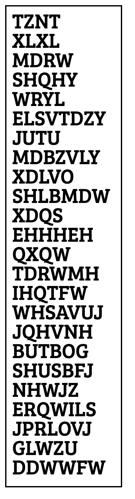
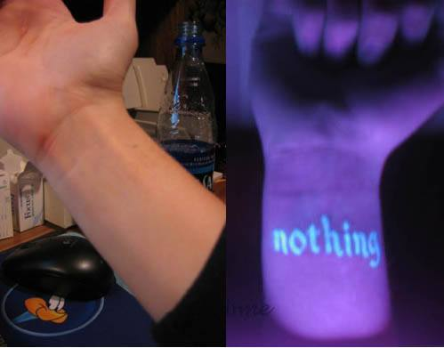

Skin Wallet
====

Store your [wallet seed phrase](https://unchained.com/blog/what-is-a-bitcoin-seed-phrase/) in plain sight, with low risk of decoding. Creates an SVG of the encrypted phrase and a QR code for coin deposit.

Example output:



Encodes words with a [Vigenère Cypher](https://en.wikipedia.org/wiki/Vigen%C3%A8re_cipher). It shifts each character in each word by one number in a list of numbers you provide (as opposed to every word shifted the same amount, like a [Caesar Cypher](https://en.wikipedia.org/wiki/Caesar_cipher)). In this way, all you have to do is remember the list to be able to decode your cyphered seed phrase and access your money. 

In theory, this could allow you to get a tattoo with this cyphered phrase and be able to access your seed phrase from anywhere, carrying nothing on your person, and without a computer, while anyone looking at the words would not be able to decypher them unless they knew the array you used to set it up.

To add another layer of security, I was thinking you could use UV-reactive tattoo ink, so you'd have to know where to look (and have a blacklight) to find the cyphered phrase.



I do not condone this. This is all just for fun and theory.

For example:

```
"TEST", [1,2,3,4]

returns

"UGVX"

In this example, `"TEST"` is one of your seed words:

"T" is shifted by 1 character, to "U".
"E" is shifted by 2 characters, to "G".
"S" is shifted by 3 characters, to "V".
"T" is shifted by 4 characters, to "X".
```

Setup
====
`pip install -r requirements.txt`


Usage
====

Generate a skin wallet:
----

`python main.py`


Decypher a skin wallet with a computer:
----
`python decypher.py`

Decypher a skin wallet without a computer:
----

Write each word vertically, and decode each letter by applying the following pattern:


1) find the position of the current letter. A is 0, B is 1, C is 2. 
2) find the shift_number, which is the number in the numeric list you memorized, against the index of the current letter. i.e.: [1,2,3,4] against `TEST`. Letter `E`'s shift_number is `2`.
3) Subtract this shift_number (item 2) from the letter_position (item 1), wrapping around the number of letters in the alphabet (26). 

For example, if the letter_position is `2 (C)`, and the shift_number is `1`, the decyphered letter is `B`. 

If the letter_position is `0 (A)`, and the shift_number is `3`, the decyphered letter is `X`. It wraps backwards around the alphabet.

```
shift_numbers: [1, 2, 3, 4]

word:
U - 1 = T
G - 2 = E
V - 3 = S
X - 4 = T
```


Example
----

Newly-generated seed phrase:
```
['perfect', 'gasp', 'floor', 'umbrella', 'party', 'rookie', 'subject', 'farm', 'zoo', 'creek', 'exclude', 'inhale', 'able', 'pole', 'access', 'crunch', 'insane', 'caution', 'prison', 'piece', 'window', 'hobby', 'record', 'snow']
```

becomes:
```
['QHWMFFY', 'HDXW', 'GOTVS', 'VPGYFOQH', 'QDWAZ', 'SRTRJH', 'TXGQFFY', 'GDWT', 'ART', 'DUJLL', 'FAHSVGJ', 'JQMHMH', 'BEQL', 'QRQL', 'BFHLTV', 'DUZUDK', 'JQXHOH', 'DDZAJRS', 'QUNZPQ', 'QLJJF', 'XLSKPZ', 'IRGIZ', 'SHHVSG', 'TQTD']
```